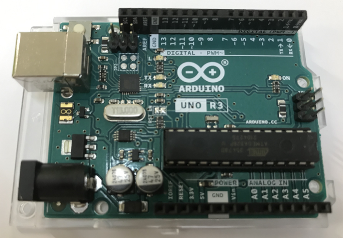
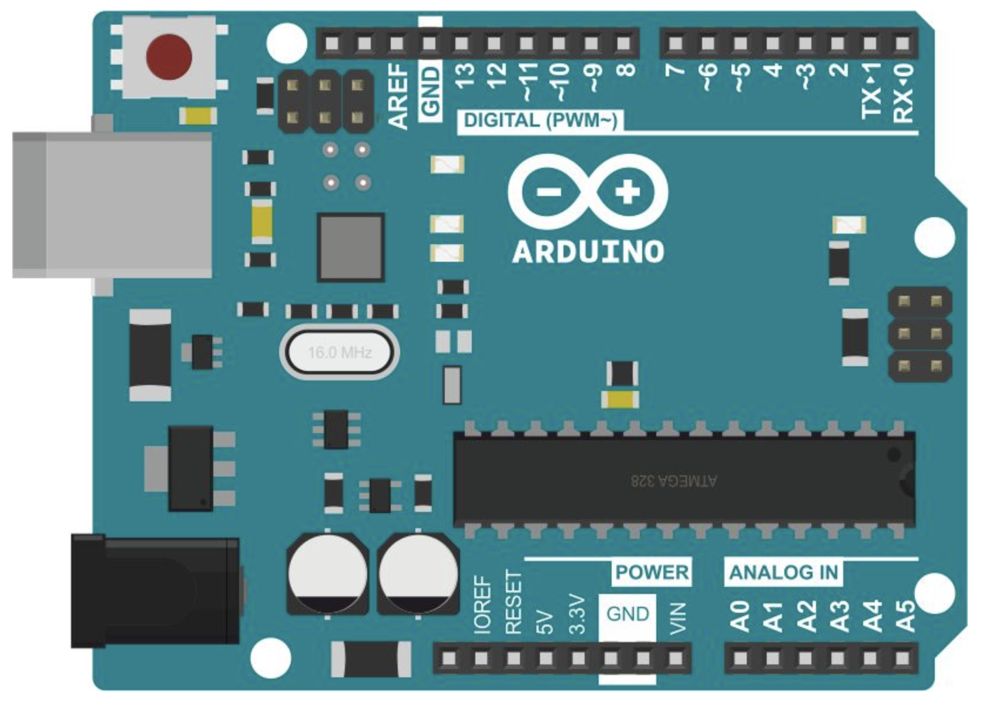
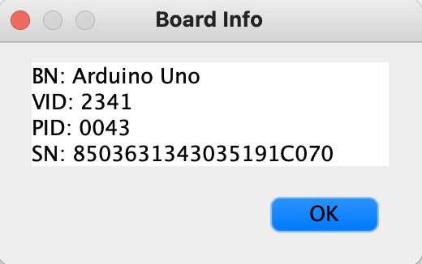
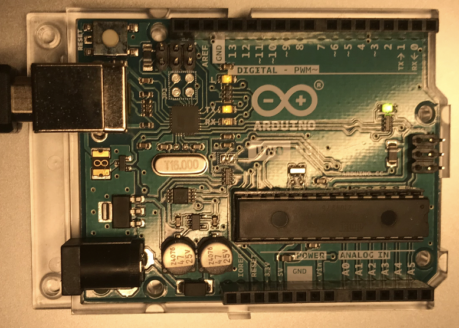

# Prepare:

1. Arduino Uno R3

       

   To draw the Arduino circuits, ref:  
   [Where to Find Free Schematic Drawing Software for Arduino, Raspberry Pi, and Other SBCs (makeuseof.com)](https://www.makeuseof.com/free-schematic-drawing-software-arduino-raspberry-pi/#:~:text)   
   The 5 Best Free Schematic Drawing Software for,5 5. Easy EDA PCB Design Tool

   - Let's just use this one.

     [Circuit Design App for Makers- circuito.io](https://www.circuito.io/app?components=512,11021)

   - To program on Mac with VSCode: 

     [(71条消息) Mac 配置Arduino开发环境并使用VSCode编写_SlowFeather的博客-CSDN博客](https://blog.csdn.net/a71468293a/article/details/117151920)

   ---

   Connect the board to the Mac with USB.

   
   <br><br><br><br><br><br><br><br>
   In VSCode, 

   
   <br><br>
   Also, test the Board.

   
   <br><br><br><br><br><br><br><br><br><br><br>
   When it comes to opening Serial Monitor, get this.
   
   ```c++
   [Starting] Opening the serial port - /dev/tty.usbmodem14101
   Hello
   Hello
   Hello
   [Done] Closed the serial port 
   ```
   
   END the program, https://www.geek-workshop.com/thread-7904-1-1.html


2. Micro servo

### <font color="Yellow">Remember to change Sketch File! </font>


# Make Programs