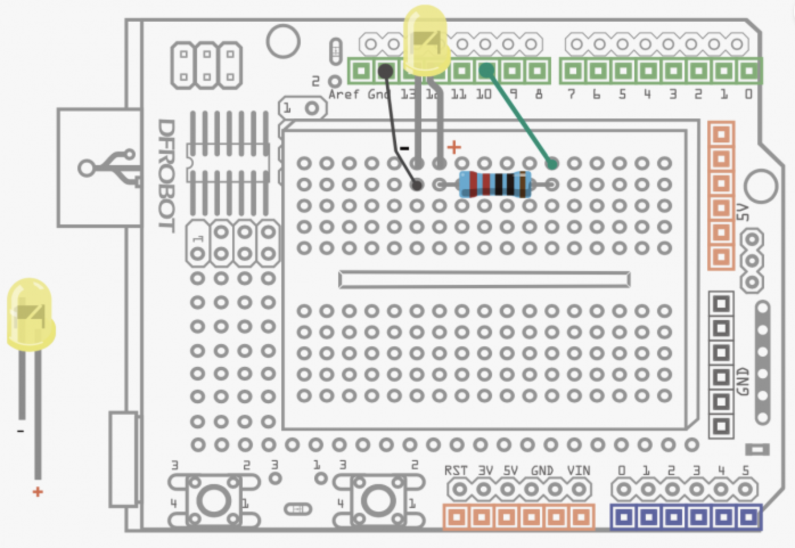
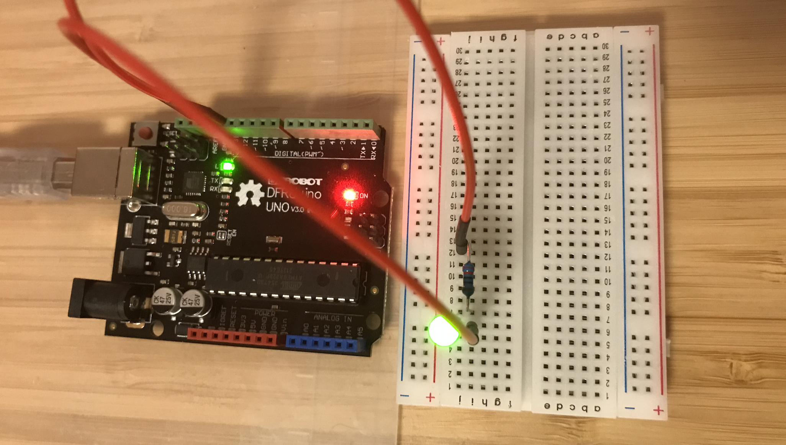

# Electric Diagram

- 

# Other Components 

- ### Jumper Cables * 2

- ### 5MM LED * 1

- ### Resistor 220R * 1

> The official Arduino UNO R3 and DFRobot DFRduino board are similar

Bend two sides of the resistor.  
Press the cables into the bread board.

With Morse Code, it can convey the information like S. O. S.