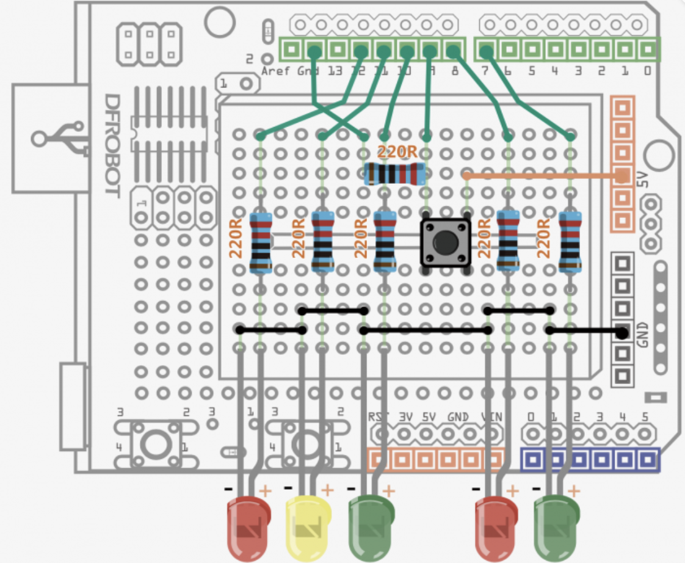
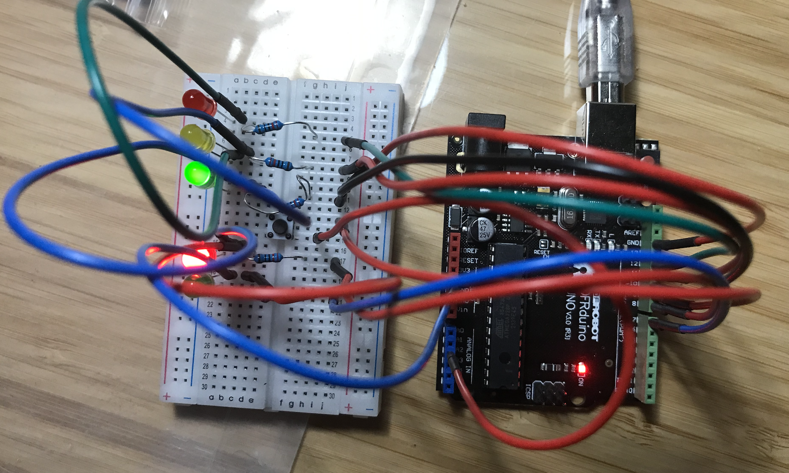
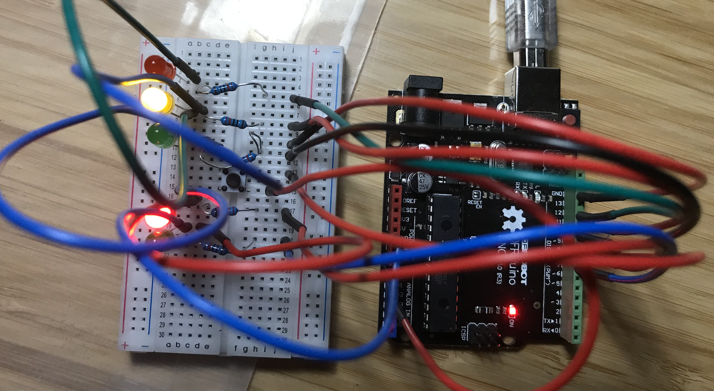
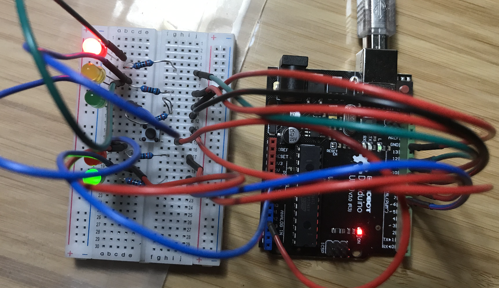

# Electric Diagram

- 

# Other Components 

- ### Jumper Cables * 13

- ### 5MM LED * 5

- ### Resistor 220R * 6

- ### Push Button * 1

Upload and Verify.

There are some bugs on pull-down resistor...  
However, the traffic lights should be fine. 

> `delay`: keep