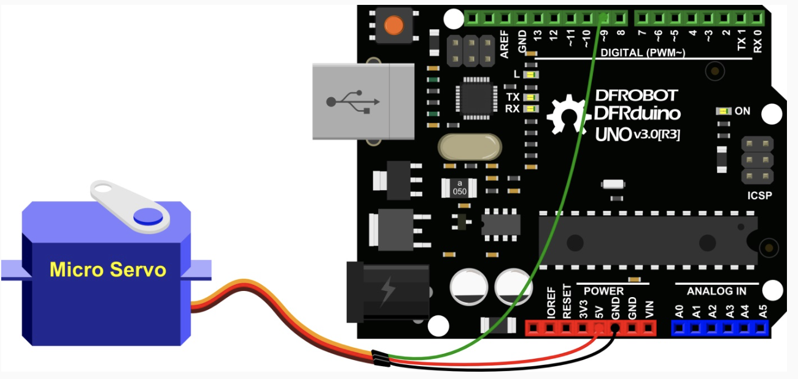
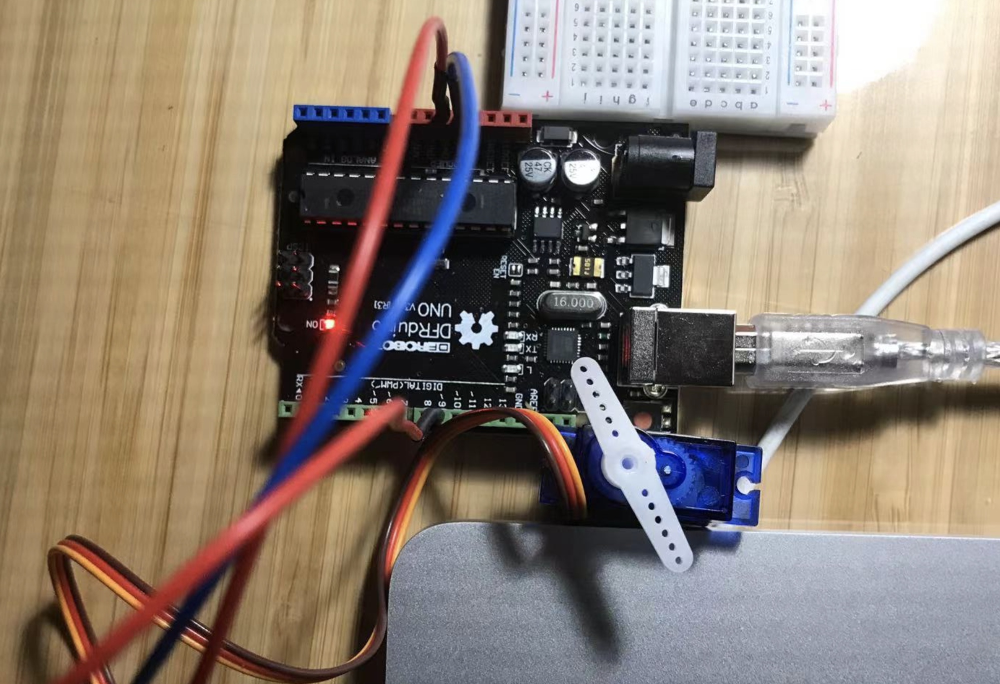
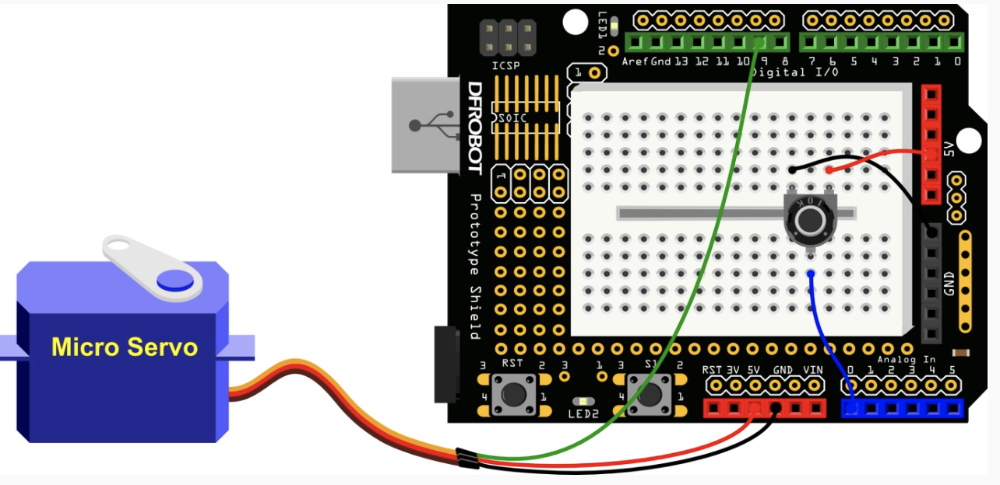

- ## To move a Servo:

  

  - Jumper Cables * 3, Servo * 1

  - Connect the lines
    1. Orange (Pin)
    2. Red (+)
    3. Brown (-)

  - The wing rotates.

    

- ## Control the servo

  

  - Jumper Cables  (M/M)  * 3, Jumper Cables  (F/M)  * 3, 
  - Servo * 1, 10K Potentiometer * 1 